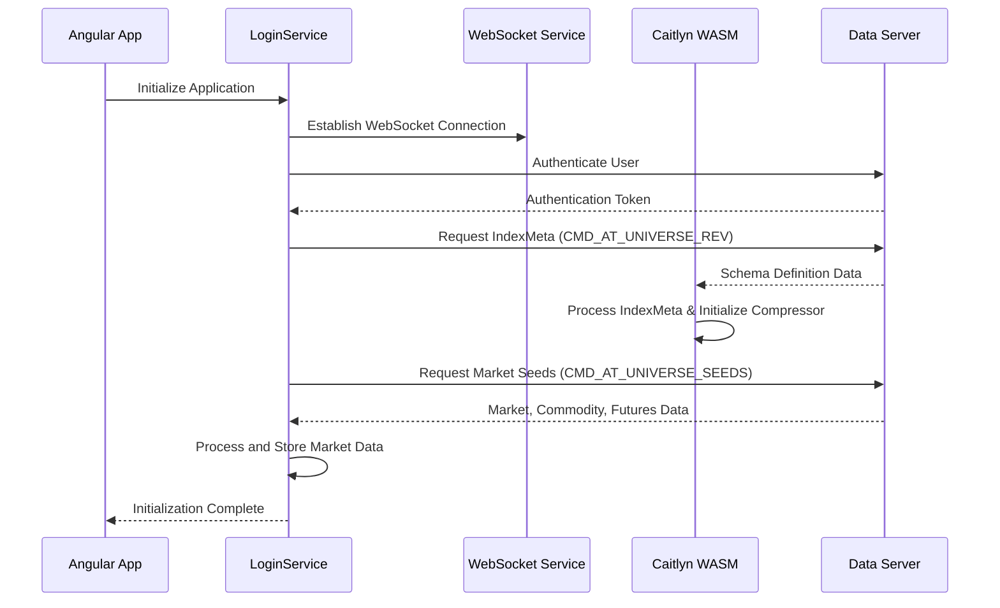

# Caitlyn WASM Module Initialization Documentation

## Overview

This document provides comprehensive documentation about the initialization process of the `caitlyn_js.wasm` module, which serves as the core data processing engine for financial market data. The module follows the official JavaScript interface defined in `docs/cxx/caitlyn_js.cpp` and provides proper command constants, class definitions, and initialization patterns.

The initialization involves establishing WebSocket connections, loading market metadata using proper WASM classes, and retrieving Market, Commodity, and Futures information from the WebSocket server using the official API.

## Key Updates

**⚠️ Important**: This documentation has been updated to reflect the official Caitlyn JavaScript API. All command references now use proper constants (e.g., `wasmModule.NET_CMD_GOLD_ROUTE_KEEPALIVE`) instead of hardcoded numbers, and all class instantiations follow the official interface patterns.

**🔧 Critical Update**: Schema-based field access patterns are now mandatory. Never hardcode StructValue field positions - always use schema definitions to determine correct field offsets.

## Table of Contents

1. [Architecture Overview](#architecture-overview)
2. [Initialization Flow](#initialization-flow)
3. [WebSocket Communication](#websocket-communication)
4. [Data Structures](#data-structures)
5. [IndexMeta and Indicator Definitions](#indexmeta-and-indicator-definitions)
6. [Market Data Loading](#market-data-loading)
7. [Error Handling](#error-handling)
8. [Code Examples](#code-examples)

## Architecture Overview

The Caitlyn WASM module is built using Emscripten and provides high-performance data processing capabilities for financial applications. The initialization process follows this layered architecture:

```
┌─────────────────────────┐
│   Angular Application   │
├─────────────────────────┤
│   Service Layer         │
│ - LoginService          │
│ - StaticDataService     │
│ - AsyncBinaryWebsocket  │
├─────────────────────────┤
│   WASM Interface        │
│ - CAITLYN Utility       │
│ - Module bindings       │
├─────────────────────────┤
│   WebSocket Layer       │
│ - Binary Protocol       │
│ - Command Processing    │
└─────────────────────────┘
```

## Initialization Flow

The initialization process consists of seven distinct phases:

### Phase Breakdown

| Phase | Progress | Description |
|-------|----------|-------------|
| 0 | USERNAME_PASSWORD | User authentication |
| 1 | GET_LANGUAGE | Language configuration loading |
| 2 | GET_META | IndexMeta and schema loading |
| 3 | GET_MARKETS | Market definitions loading |
| 4 | GET_SEEDS | Market seed data (Security, Commodity, Futures) |
| 5 | GET_SOURCE_CODES | Source code definitions |
| 6 | REG_FORMULAS | Formula registration |

### Detailed Flow



## WebSocket Communication

### Protocol Commands

The system uses binary WebSocket communication with specific command types:

#### Core Commands for Initialization

```typescript
// Command constants from caitlyn_js.wasm
const Commands = {
    NET_CMD_GOLD_ROUTE_DATADEF: "Data definition/schema loading",
    CMD_AT_UNIVERSE_REV: "Universe revision/metadata request",
    CMD_AT_UNIVERSE_SEEDS: "Market seed data request",
    CMD_AT_FETCH_BY_TIME: "Time-based data fetching",
    CMD_AT_FETCH_BY_CODE: "Code-based data fetching"
};
```

#### Message Structure

All WebSocket messages follow this binary protocol structure:

```cpp
struct NetPackage {
    PackageHeader header;
    vector<uint8_t> content;
};

struct PackageHeader {
    int16_t cmd;        // Command type
    int32_t seq;        // Sequence number
    // Additional header fields...
};
```

### WebSocket Service Integration

The `AsyncBinaryWebsocketService` manages the WebSocket communication:

```typescript
// Key service methods
class AsyncBinaryWebsocketService {
    send(subscribe: boolean, msgDict: any, callback: Function): number;
    addJob(seq: number, callback: Function): void;
    onMessage(result: any): void;
}
```

## Data Structures

### Market Data Types

The system supports four primary market data types:

#### 1. Security Data
```typescript
interface Security {
    code: string;           // Security identifier
    name: string;           // Display name
    market: string;         // Market identifier
    // Additional security properties
}
```

#### 2. Commodity Data  
```typescript
interface Commodity {
    code: string;           // Commodity code
    name: string;           // Commodity name
    market: string;         // Market identifier
    futures?: Future[];     // Associated futures contracts
    // Additional commodity properties
}
```

#### 3. Futures Data
```typescript
interface Future {
    code: string;           // Future contract code
    name: string;           // Contract name
    commodity: string;      // Underlying commodity
    market: string;         // Market identifier
    // Additional futures properties
}
```

#### 4. Stock Data
```typescript
interface Stock {
    code: string;           // Stock symbol
    name: string;           // Company name
    market: string;         // Market identifier
    // Additional stock properties
}
```

### Data Organization

Market data is organized in the `StaticDataService`:

```typescript
class StaticData {
    // Core data maps
    public marketSeedsMap: {[market: string]: {[seedType: string]: any[]}} = {};
    public code2MarketsMap: {[code: string]: string} = {};
    public securityMap: {[key: string]: any} = {};
    
    // Processed data
    public allCommodities: Commodity[] = [];
}
```

## IndexMeta and Indicator Definitions

### IndexMeta Structure

`IndexMeta` serves as the core metadata structure that defines indicator schemas:

```cpp
class IndexMeta {
    uint32_t ID;                    // Unique identifier
    string namespace;               // Namespace/category
    string name;                    // Indicator name
    string displayName;             // Human-readable name
    vector<uint32_t> granularities; // Supported time granularities
    ShareOption share;              // Sharing configuration
    IndexType indexType;            // Type classification
    uint32_t revision;              // Version number
    string authorUUID;              // Creator identifier
    vector<IndexField> fields;      // Field definitions
};
```

### Index Fields

Each indicator supports multiple data fields with specific types:

```cpp
enum DataType {
    INT,        // 32-bit integer
    DOUBLE,     // Double precision float  
    STRING,     // Text string
    VINT,       // Vector of integers
    VDOUBLE,    // Vector of doubles
    VSTRING,    // Vector of strings
    INT64,      // 64-bit integer
    VINT64      // Vector of 64-bit integers
};

class IndexField {
    uint32_t pos;           // Field position
    string name;            // Field name
    DataType type;          // Data type
    uint32_t precision;     // Decimal precision
    bool multiple;          // Multi-value field
    SampleType sampleType;  // Sampling method
};
```

### Schema Loading Process

The schema loading follows this process:

1. **Schema Request**: Send `CMD_AT_UNIVERSE_REV` to server
2. **Schema Processing**: WASM module processes `NET_CMD_GOLD_ROUTE_DATADEF`
3. **Metadata Extraction**: Parse `IndexMeta` objects from schema
4. **Compressor Initialization**: Create and configure `IndexSerializer`
5. **Field Mapping**: Map field types to accessor functions

```typescript
// CAITLYN utility processes schemas
CAITLYN.decode(pkg) {
    case Module.NET_CMD_GOLD_ROUTE_DATADEF:
        // Create new schema object
        CAITLYN.M.IndexSchema = new Module.IndexSchema();
        schema.load(content);
        
        // Process each meta definition
        let metas = schema.metas();
        for (let i = 0; i < metas.size(); i++) {
            let meta = metas.get(i);
            // Store schema and field mappings
            CAITLYN.SCHEMA[meta.namespace][meta.ID] = meta;
            CAITLYN.META[meta.namespace][meta.ID] = processedMeta;
        }
        
        // Initialize compressor
        CAITLYN.COMPRESSOR = new Module.IndexSerializer();
        CAITLYN.COMPRESSOR.updateSchema(schema);
}
```

## Market Data Loading

### Seed Data Request

Market seed data is requested using `CMD_AT_UNIVERSE_SEEDS`:

```typescript
// Request parameters
const seedRequest = {
    cmd: Module.CMD_AT_UNIVERSE_SEEDS,
    rev: revisionNumber,
    namespace: "Market",
    qualified_name: "seeds",
    market: marketCode,
    trade_day: currentTradeDay
};
```

### Data Processing Pipeline

1. **Raw Data Reception**: Binary data received via WebSocket
2. **WASM Decompression**: Use IndexSerializer for decompression  
3. **Type Classification**: Sort data into Security, Commodity, Futures, Stock
4. **Relationship Building**: Link commodities with their futures contracts
5. **Storage & Caching**: Store in memory and IndexedDB

### Market Data Enrichment

The system performs data enrichment after loading:

```typescript
public enrichCommodity() {
    // Link commodities with their futures
    for (let market in this.marketSeedsMap) {
        let commodities = this.marketSeedsMap[market]["Commodity"];
        let futures = this.marketSeedsMap[market]["Futures"];
        
        if (commodities && futures) {
            let commodityMap = {};
            commodities.forEach(commodity => {
                commodityMap[commodity.code] = commodity;
            });
            
            futures.forEach(future => {
                let commodity = commodityMap[future.commodity];
                if (commodity) {
                    if (!commodity.futures) {
                        commodity.futures = [];
                    }
                    commodity.futures.push(future);
                }
            });
        }
    }
}
```

## Error Handling

### Connection Management

The system implements robust error handling:

```typescript
// Reconnection handling
this.binaryWebsocket.reconnected.subscribe(res => {
    this.binarySystemLogin(); // Restart initialization
});

// Market clock monitoring  
this.binaryAsyncWebsocket.addJob("-1", (res, msg) => {
    if (this.cnt >= this.maxCnt) {
        this.binarySystemLogin(); // Reinitialize on timeout
    }
    this.cnt = 0;
});
```

### Data Validation

```typescript
public isReady(): boolean {
    if (Object.keys(this.marketSeedsMap).length == 0 ||
        Object.keys(this.marketSeedsMap).length != Object.keys(this.code2MarketsMap).length) {
        return false;
    }
    return true;
}
```

## Code Examples

### Complete Initialization Example

```typescript
// LoginService initialization method
async binarySystemLogin() {
    try {
        // Phase 0: Authentication
        const token = await this.authenticate();
        this.updateProgress(PROGRESS.USERNAME_PASSWORD);
        
        // Phase 1: Language loading
        await this.loadLanguages();
        this.updateProgress(PROGRESS.GET_LANGUAGE);
        
        // Phase 2: Schema loading
        await this.loadIndexMeta();
        this.updateProgress(PROGRESS.GET_META);
        
        // Phase 3: Market loading
        await this.loadMarkets();
        this.updateProgress(PROGRESS.GET_MARKETS);
        
        // Phase 4: Seed data loading
        await this.loadMarketSeeds();
        this.updateProgress(PROGRESS.GET_SEEDS);
        
        // Phase 5: Source codes
        await this.loadSourceCodes();
        this.updateProgress(PROGRESS.GET_SOURCE_CODES);
        
        // Phase 6: Formula registration
        await this.registerFormulas();
        this.updateProgress(PROGRESS.REG_FORMULAS);
        
        // Initialization complete
        this.isReady = true;
        this.notifyReady();
        
    } catch (error) {
        console.error('Initialization failed:', error);
        this.handleInitializationError(error);
    }
}
```

### WASM Module Usage Example

```typescript
// Using the initialized WASM module for data processing
function processMarketData(namespace: string, metaID: number, binaryData: Uint8Array) {
    // Get the appropriate schema
    const schema = CAITLYN.SCHEMA[namespace][metaID];
    const fields = CAITLYN.META[namespace][metaID].fields;
    
    // Deserialize the binary data
    const deserializer = CAITLYN.COMPRESSOR;
    const result = deserializer.deserializeByTime(binaryData, namespace, metaID);
    
    // Process each field
    const processedData = {};
    fields.forEach(field => {
        const value = result[field.func](field.pos);
        processedData[field.name] = value;
    });
    
    return processedData;
}
```

### Market Data Query Example

```typescript
// Query available tickers after initialization
function getAvailableTickers(market?: string): string[] {
    if (!this.staticData.isReady()) {
        throw new Error('Market data not ready. Complete initialization first.');
    }
    
    const tickers = [];
    const markets = market ? [market] : Object.keys(this.staticData.marketSeedsMap);
    
    markets.forEach(marketCode => {
        const seeds = this.staticData.marketSeedsMap[marketCode];
        
        // Collect all security codes
        if (seeds.Security) {
            tickers.push(...seeds.Security.map(s => s.code));
        }
        
        // Collect all futures codes  
        if (seeds.Futures) {
            tickers.push(...seeds.Futures.map(f => f.code));
        }
        
        // Collect all stock codes
        if (seeds.Stock) {
            tickers.push(...seeds.Stock.map(s => s.code));
        }
    });
    
    return [...new Set(tickers)]; // Remove duplicates
}
```

## Key Requirements

### Prerequisites for Initialization

1. **WebSocket Connection**: Stable connection to the data server
2. **Authentication Token**: Valid user authentication 
3. **WASM Module**: `caitlyn_js.wasm` module must be loaded
4. **Memory Allocation**: Sufficient memory for market data storage

### Critical Success Factors

1. **Sequential Loading**: Phases must complete in order
2. **Schema First**: IndexMeta must be loaded before seed data
3. **Error Recovery**: Robust handling of connection failures
4. **Memory Management**: Proper cleanup of WASM objects
5. **Schema-Based Field Access**: Always use schema definitions for StructValue field positions

### Performance Considerations

- Binary WebSocket protocol provides efficient data transfer
- WASM module enables high-performance data processing
- IndexedDB provides persistent storage for offline capabilities
- Compression reduces bandwidth requirements

### Field Access Best Practices

**CRITICAL**: Always determine field positions from schema, never hardcode them:

```javascript
// ✅ CORRECT: Use schema_decoder.js to find field positions
// Market structure (ID: 3) field mapping:
// Field 0: trade_day, Field 1: name, Field 2: time_zone, Field 7: revs

if (structValue.metaID === 3) {
    const tradeDay = structValue.getInt32(0);    // Field 0: trade_day
    const marketName = structValue.getString(1); // Field 1: name
    const timeZone = structValue.getString(2);   // Field 2: time_zone
    const revisions = structValue.getString(7);  // Field 7: revs
}

// ❌ INCORRECT: Hardcoded field positions
const tradeDay = structValue.getInt32(2);  // Wrong! Field 2 is time_zone

// ✅ Use schema_decoder.js to verify:
// cd docs && node schema_decoder.js | grep -A 10 "ID: 3"
```

---

**Note**: All market data, tickers, and indicator definitions are only available after successful completion of the initialization process. Applications should verify `StaticData.isReady()` returns `true` before attempting to access market data or perform data queries.