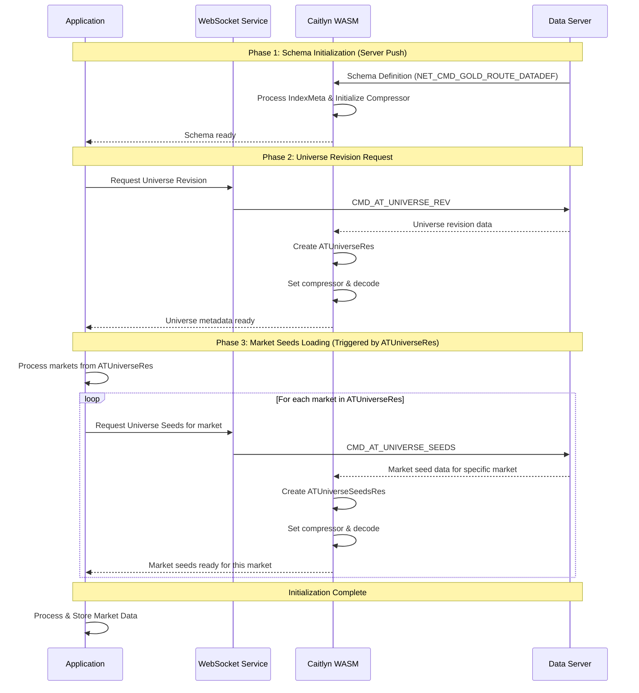
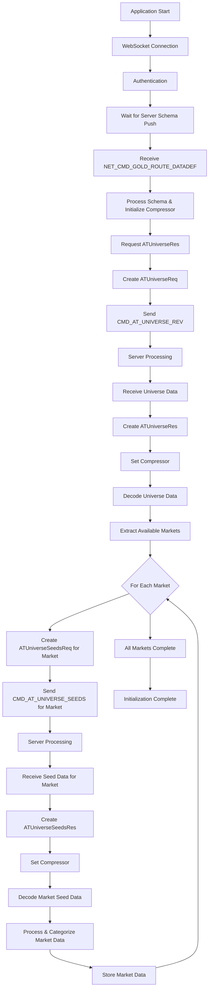

# ATUniverseRes and ATUniverseSeeds Initialization Documentation

## Overview

This document provides comprehensive documentation on the initialization process of `ATUniverseRes` and `ATUniverseSeeds` within the Caitlyn WASM financial data processing system. These components are critical for loading and managing market metadata and seed data that form the foundation of the financial data infrastructure.

## Table of Contents

1. [Architecture Overview](#architecture-overview)
2. [ATUniverseRes Initialization](#atuniverse-res-initialization)
3. [ATUniverseSeeds Initialization](#atuniverse-seeds-initialization)
4. [Request/Response Flow](#request-response-flow)
5. [Data Processing Pipeline](#data-processing-pipeline)
6. [Error Handling](#error-handling)
7. [Code Examples](#code-examples)
8. [Best Practices](#best-practices)

## Architecture Overview

The ATUniverse initialization system consists of two main components:

### Component Architecture

```
┌─────────────────────────────────────────────────────────────────┐
│                    Caitlyn WASM System                         │
├─────────────────────────────────────────────────────────────────┤
│  ┌─────────────────┐    ┌─────────────────┐                    │
│  │  ATUniverseRes  │    │ATUniverseSeeds  │                    │
│  │                 │    │                 │                    │
│  │ - Universe      │    │ - Market Seeds  │                    │
│  │   Revision      │    │ - Commodity     │                    │
│  │ - Metadata      │    │   Data          │                    │
│  │ - Schema Info   │    │ - Futures Data  │                    │
│  └─────────────────┘    │ - Security Data │                    │
│            │             └─────────────────┘                    │
│            │                       │                           │
│  ┌─────────────────────────────────────────────────────────────┤
│  │               Binary WebSocket Layer                        │
│  └─────────────────────────────────────────────────────────────┤
│  ┌─────────────────────────────────────────────────────────────┤
│  │                   Server Communication                      │
│  └─────────────────────────────────────────────────────────────┘
```

### Initialization Flow



## ATUniverseRes Initialization

### Purpose and Function

`ATUniverseRes` handles the initialization of universe-level metadata and revision information. It serves as the foundation for understanding what data namespaces and schemas are available in the system.

### Key Components

#### 1. ATUniverseRes Class Structure
```cpp
class ATUniverseRes {
    // Core properties
    uint32_t seq;           // Sequence number
    uint32_t status;        // Response status
    uint32_t errorCode;     // Error code if any
    string errorMsg;        // Error message
    
    // Universe data
    Map<string, int32_t> revisions;  // Namespace revisions
    
    // Methods
    void setCompressor(IndexSerializer* compressor);
    void decode(const vector<uint8_t>& content);
    Map<string, int32_t> revs();
};
```

#### 2. Initialization Process

The ATUniverseRes initialization follows these steps:

##### Step 1: Request Creation
```typescript
// Create universe revision request
const request = new Module.ATUniverseReq(authToken, sequenceNumber);
```

##### Step 2: Binary Message Dispatch
```typescript
// Send binary WebSocket message
const cmd = Module.CMD_AT_UNIVERSE_REV;
this.sendBinaryMessage(cmd, request);
```

##### Step 3: Response Processing
```typescript
// In CAITLYN.decode() method
case Module.CMD_AT_UNIVERSE_REV:
    // Clean up previous instance
    CAITLYN.delete(CAITLYN.M.ATUniverseRes);
    
    // Create new ATUniverseRes instance
    CAITLYN.M.ATUniverseRes = new Module.ATUniverseRes();
    res = CAITLYN.M.ATUniverseRes;
    
    // Set compressor for data decompression
    res.setCompressor(CAITLYN.COMPRESSOR);
    
    // Decode the binary content
    res.decode(content);
    break;
```

##### Step 4: Data Extraction
```typescript
// Access revision information
const revisions = response.revs();
const namespaces = Object.keys(revisions);

// Process each namespace
namespaces.forEach(namespace => {
    const revision = revisions[namespace];
    console.log(`Namespace: ${namespace}, Revision: ${revision}`);
});
```

### Data Structure and Content

The ATUniverseRes contains:

- **Revision Information**: Maps namespaces to their current revision numbers
- **Status Information**: Success/failure status and error details
- **Metadata**: Information about available data schemas and universes

### Usage in WebSocket Service

```typescript
// In AsyncBinaryWebsocketService
case Module.CMD_AT_UNIVERSE_REV:
    {
        req = new Module.ATUniverseReq(token, this.seq);
    }
    break;
```

## ATUniverseSeeds Initialization

### Purpose and Function

`ATUniverseSeeds` manages the loading of market seed data including commodities, futures, securities, and other financial instruments. This data forms the foundation for all market operations.

### Key Components

#### 1. ATUniverseSeedsRes Class Structure
```cpp
class ATUniverseSeedsRes {
    // Core properties
    uint32_t seq;           // Sequence number
    uint32_t status;        // Response status  
    uint32_t errorCode;     // Error code if any
    string errorMsg;        // Error message
    
    // Seed data
    vector<StructValue> seedData;   // Market seed data
    
    // Methods
    void setCompressor(IndexSerializer* compressor);
    void decode(const vector<uint8_t>& content);
    vector<StructValue> seed_data();
};
```

#### 2. Request Parameters

ATUniverseSeeds requests require specific parameters:

```typescript
interface SeedRequestParams {
    token: string;              // Authentication token
    seq: number;                // Sequence number
    rev: number;                // Revision number
    namespace: string;          // Data namespace (e.g., "global")
    qualified_name: string;     // Qualified name (e.g., "Commodity", "Futures")
    market: string;             // Market identifier (e.g., "DME", "SHFE")
    trade_day: number;          // Trade day (0 for current)
}
```

#### 3. Initialization Process

##### Step 1: Request Creation
```typescript
// Create universe seeds request
const request = new Module.ATUniverseSeedsReq(
    authToken,        // Authentication token
    sequenceNumber,   // Sequence number
    revision,         // Revision number
    namespace,        // Namespace (e.g., "global")
    qualifiedName,    // Qualified name (e.g., "Commodity")
    market,           // Market code (e.g., "DME")
    tradeDay          // Trade day (0 for current)
);
```

##### Step 2: Binary Message Dispatch
```typescript
// Send binary WebSocket message
const cmd = Module.CMD_AT_UNIVERSE_SEEDS;
this.sendBinaryMessage(cmd, request);
```

##### Step 3: Response Processing
```typescript
// In CAITLYN.decode() method
case Module.CMD_AT_UNIVERSE_SEEDS:
    // Clean up previous instance
    CAITLYN.delete(CAITLYN.M.ATUniverseSeedsRes);
    
    // Create new ATUniverseSeedsRes instance
    CAITLYN.M.ATUniverseSeedsRes = new Module.ATUniverseSeedsRes();
    res = CAITLYN.M.ATUniverseSeedsRes;
    
    // Set compressor for data decompression
    res.setCompressor(CAITLYN.COMPRESSOR);
    
    // Decode the binary content
    res.decode(content);
    break;
```

##### Step 4: Seed Data Processing
```typescript
// Extract seed data
const seedData = response.seed_data();
const seedCount = seedData.size();

// Process each seed entry
for (let i = 0; i < seedCount; i++) {
    const seedEntry = seedData.get(i);
    
    // CRITICAL: Extract market data using schema-based field positions
    const processedData = this.processSeedEntry(seedEntry);
    
    // Categorize data (Commodity, Futures, Security, etc.)
    this.categorizeMarketData(processedData);
    
    // Clean up StructValue entry
    seedEntry.delete();
}
```

##### Critical: Schema-Based Field Access

**NEVER hardcode field positions** when accessing StructValue fields. Always use schema definitions:

```javascript
// CORRECT: Schema-based field access for Market structure (ID: 3)
if (sv.metaID === 3) { // Market metadata
    const tradeDay = sv.getInt32(0);    // Field 0: trade_day
    const name = sv.getString(1);       // Field 1: name
    const timeZone = sv.getString(2);   // Field 2: time_zone  
    const revisions = sv.getString(7);  // Field 7: revs (JSON data)
}

// INCORRECT: Hardcoded field positions
const tradeDay = sv.getInt32(2);  // Wrong! Field 2 is time_zone, not trade_day
```

**Use schema_decoder.js to verify field positions:**

```bash
cd docs && node schema_decoder.js | grep -A 20 "Market {"
# Output shows:
# Field 0: trade_day
# Field 1: name  
# Field 2: time_zone
# Field 7: revs
```

### Seed Data Types

The system supports multiple types of market seed data:

#### 1. Commodity Data

```typescript
interface CommodityData {
    code: string;           // Commodity code
    name: string;           // Display name
    market: string;         // Market identifier
    category: string;       // Commodity category
    futures: Future[];      // Associated futures contracts
}
```

#### 2. Futures Data

```typescript
interface FuturesData {
    code: string;           // Contract code
    name: string;           // Contract name
    commodity: string;      // Underlying commodity
    market: string;         // Market identifier
    expiryDate: Date;       // Expiry date
    contractSize: number;   // Contract size
}
```

#### 3. Security Data

```typescript
interface SecurityData {
    code: string;           // Security symbol
    name: string;           // Security name
    market: string;         // Market identifier
    type: string;           // Security type
    currency: string;       // Currency
}
```

### Usage in WebSocket Service

```typescript
// In AsyncBinaryWebsocketService
case Module.CMD_AT_UNIVERSE_SEEDS:
    {
        req = new Module.ATUniverseSeedsReq(
            token,
            this.seq,
            msgDict.rev,              // Revision
            msgDict.namespace,        // Namespace
            msgDict.qualified_name,   // Qualified name
            msgDict.market,           // Market
            msgDict.trade_day         // Trade day
        );
    }
    break;
```

## Request/Response Flow

### Important: Correct Initialization Sequence

**Key Points:**
1. **Schema is Server-Pushed**: The schema information (`NET_CMD_GOLD_ROUTE_DATADEF`) is automatically pushed by the server, not requested by `CMD_AT_UNIVERSE_REV`
2. **ATUniverseRes Triggers Seeds Requests**: The `ATUniverseRes` response contains the available markets, which then triggers individual `ATUniverseSeedsReq` requests for each market
3. **One Seeds Request per Market**: Each market requires a separate `CMD_AT_UNIVERSE_SEEDS` request

### Complete Flow Diagram



### Timing Considerations

The initialization process has specific timing requirements:

1. **Sequential Processing**: ATUniverseRes must complete before ATUniverseSeeds
2. **Schema Dependency**: Both require the schema to be loaded first
3. **Market-Specific Loading**: ATUniverseSeeds is requested per market
4. **Error Recovery**: Failed requests should trigger retry mechanisms

## Data Processing Pipeline

### 1. Binary Data Decoding

```typescript
class DataProcessor {
    processBinaryResponse(cmd: number, content: Uint8Array) {
        let response;
        
        switch (cmd) {
            case Module.CMD_AT_UNIVERSE_REV:
                response = new Module.ATUniverseRes();
                break;
                
            case Module.CMD_AT_UNIVERSE_SEEDS:
                response = new Module.ATUniverseSeedsRes();
                break;
        }
        
        // Set compressor for decompression
        response.setCompressor(this.compressor);
        
        // Decode binary content
        response.decode(content);
        
        return response;
    }
}
```

### 2. Data Structure Processing

```typescript
// Process ATUniverseRes data
processUniverseResponse(response: ATUniverseRes) {
    const revisions = response.revs();
    
    // Store revision information
    Object.keys(revisions).forEach(namespace => {
        this.revisionMap[namespace] = revisions[namespace];
    });
    
    // Trigger next phase: seed data loading
    this.requestMarketSeeds();
}

// Process ATUniverseSeeds data
processSeedsResponse(response: ATUniverseSeedsRes) {
    const seedData = response.seed_data();
    const processedSeeds = [];
    
    for (let i = 0; i < seedData.size(); i++) {
        const seed = seedData.get(i);
        const processed = this.convertStructValueToJson(seed);
        processedSeeds.push(processed);
    }
    
    // Categorize and store seeds
    this.categorizeSeeds(processedSeeds);
}
```

### 3. Data Conversion

```typescript
// Convert WASM StructValue to JavaScript object
convertStructValueToJson(structValue: StructValue): any {
    const namespace = structValue.namespace;
    const metaID = structValue.metaID;
    const fields = this.schema[namespace][metaID].fields;
    
    const result = {
        time_tag: Number(structValue.timeTag),
        granularity: structValue.granularity,
        code: structValue.stockCode,
        market: structValue.market,
        meta_name: this.schema[namespace][metaID].name,
        namespace: namespace === Module.NAMESPACE_GLOBAL ? "global" : "private"
    };
    
    // Process each field
    fields.forEach((field, index) => {
        if (!structValue.isEmpty(index)) {
            const value = this.extractFieldValue(structValue, field, index);
            result[field.name] = value;
        }
    });
    
    return result;
}
```

## Error Handling

### Common Error Scenarios

#### 1. Network Errors
```typescript
class ErrorHandler {
    handleNetworkError(error: Error) {
        console.error('Network error during initialization:', error);
        
        // Implement exponential backoff retry
        setTimeout(() => {
            this.retryInitialization();
        }, this.calculateBackoffTime());
    }
    
    calculateBackoffTime(): number {
        return Math.min(1000 * Math.pow(2, this.retryCount), 30000);
    }
}
```

#### 2. Data Decoding Errors
```typescript
handleDecodingError(cmd: number, content: Uint8Array, error: Error) {
    console.error(`Decoding error for command ${cmd}:`, error);
    
    // Log binary data info for debugging
    console.log('Content length:', content.length);
    console.log('Content type:', typeof content);
    
    // Attempt recovery
    if (cmd === Module.CMD_AT_UNIVERSE_REV) {
        this.retryUniverseRequest();
    } else if (cmd === Module.CMD_AT_UNIVERSE_SEEDS) {
        this.retrySeedsRequest();
    }
}
```

#### 3. Schema Validation Errors
```typescript
validateSchema(response: any): boolean {
    if (!response) {
        console.error('Empty response received');
        return false;
    }
    
    if (response.status !== 0) {
        console.error('Server error:', response.errorMsg);
        return false;
    }
    
    if (!response.revs || Object.keys(response.revs()).length === 0) {
        console.error('No revision data received');
        return false;
    }
    
    return true;
}
```

### Memory Management

```typescript
class MemoryManager {
    cleanupWASMObjects() {
        // Clean up ATUniverseRes
        if (this.universeRes) {
            this.universeRes.delete();
            this.universeRes = null;
        }
        
        // Clean up ATUniverseSeedsRes
        if (this.seedsRes) {
            this.seedsRes.delete();
            this.seedsRes = null;
        }
        
        // Clean up other WASM objects
        this.cleanupVectors();
    }
    
    cleanupVectors() {
        this.managedObjects.forEach(obj => {
            if (obj && typeof obj.delete === 'function') {
                obj.delete();
            }
        });
        this.managedObjects = [];
    }
}
```

## Code Examples

### Complete Initialization Example

```typescript
class UniverseInitializer {
    private wsClient: WebSocketClient;
    private compressor: any;
    private schema: any = {};
    private revisions: any = {};
    private marketData: any = {};
    
    constructor(wsClient: WebSocketClient) {
        this.wsClient = wsClient;
    }
    
    async initialize(): Promise<void> {
        try {
            // Step 1: Wait for schema to be ready
            await this.waitForSchema();
            
            // Step 2: Request universe revision
            await this.requestUniverseRevision();
            
            // Step 3: Process markets and request seeds
            await this.requestMarketSeeds();
            
            console.log('Universe initialization complete');
            
        } catch (error) {
            console.error('Universe initialization failed:', error);
            throw error;
        }
    }
    
    private async requestUniverseRevision(): Promise<void> {
        return new Promise((resolve, reject) => {
            const request = new Module.ATUniverseReq(
                this.wsClient.authToken,
                this.wsClient.getNextSequence()
            );
            
            // Send request
            this.wsClient.sendBinaryMessage(
                Module.CMD_AT_UNIVERSE_REV, 
                request,
                (response) => {
                    try {
                        this.processUniverseResponse(response);
                        resolve();
                    } catch (error) {
                        reject(error);
                    }
                }
            );
        });
    }
    
    private processUniverseResponse(response: any): void {
        // Validate response
        if (response.status !== 0) {
            throw new Error(`Universe request failed: ${response.errorMsg}`);
        }
        
        // Extract and store revisions
        const revs = response.revs();
        Object.keys(revs).forEach(namespace => {
            this.revisions[namespace] = revs[namespace];
        });
        
        console.log('Universe revisions loaded:', this.revisions);
    }
    
    private async requestMarketSeeds(): Promise<void> {
        // Get available markets from the ATUniverseRes response
        const availableMarkets = this.extractMarketsFromUniverseRes();
        const seedTypes = ['Commodity', 'Futures', 'Security'];
        
        const promises = [];
        
        // Request seeds for each market returned by ATUniverseRes
        availableMarkets.forEach(market => {
            seedTypes.forEach(seedType => {
                promises.push(this.requestSeedData(market, seedType));
            });
        });
        
        await Promise.all(promises);
    }
    
    private extractMarketsFromUniverseRes(): string[] {
        // Extract market codes from the ATUniverseRes response
        // This method would parse the universe response to get available markets
        const markets = [];
        
        // The actual implementation would extract markets from the decoded ATUniverseRes
        // Example: Parse the revisions or market data from the response
        Object.keys(this.revisions).forEach(namespace => {
            if (namespace.includes('market')) {
                // Extract market identifier from namespace or revision data
                markets.push(this.parseMarketFromNamespace(namespace));
            }
        });
        
        return markets;
    }
    
    private parseMarketFromNamespace(namespace: string): string {
        // Parse market code from namespace string
        // Implementation would depend on the actual namespace format
        return namespace.split('.').pop() || namespace;
    }
    
    private async requestSeedData(market: string, seedType: string): Promise<void> {
        return new Promise((resolve, reject) => {
            const revision = this.revisions['global'] || 1;
            
            const request = new Module.ATUniverseSeedsReq(
                this.wsClient.authToken,
                this.wsClient.getNextSequence(),
                revision,
                'global',           // namespace
                seedType,           // qualified_name
                market,             // market
                0                   // trade_day (current)
            );
            
            this.wsClient.sendBinaryMessage(
                Module.CMD_AT_UNIVERSE_SEEDS,
                request,
                (response) => {
                    try {
                        this.processSeedsResponse(response, market, seedType);
                        resolve();
                    } catch (error) {
                        reject(error);
                    }
                }
            );
        });
    }
    
    private processSeedsResponse(response: any, market: string, seedType: string): void {
        // Validate response
        if (response.status !== 0) {
            console.warn(`Seeds request failed for ${market}/${seedType}: ${response.errorMsg}`);
            return;
        }
        
        // Extract seed data
        const seedData = response.seed_data();
        const processedSeeds = [];
        
        for (let i = 0; i < seedData.size(); i++) {
            const seed = seedData.get(i);
            const processed = this.convertSeedToJson(seed);
            processedSeeds.push(processed);
        }
        
        // Store in market data structure
        if (!this.marketData[market]) {
            this.marketData[market] = {};
        }
        this.marketData[market][seedType] = processedSeeds;
        
        console.log(`Loaded ${processedSeeds.length} ${seedType} seeds for ${market}`);
    }
    
    private convertSeedToJson(structValue: any): any {
        const namespace = structValue.namespace;
        const metaID = structValue.metaID;
        
        if (!this.schema[namespace] || !this.schema[namespace][metaID]) {
            console.warn(`Schema not found for namespace: ${namespace}, metaID: ${metaID}`);
            return null;
        }
        
        const meta = this.schema[namespace][metaID];
        const result: any = {
            time_tag: Number(structValue.timeTag),
            code: structValue.stockCode,
            market: structValue.market,
            meta_name: meta.name
        };
        
        // Process fields according to schema
        meta.fields.forEach((field: any, index: number) => {
            if (!structValue.isEmpty(index)) {
                const value = this.extractFieldValue(structValue, field, index);
                result[field.name] = value;
            }
        });
        
        return result;
    }
    
    private extractFieldValue(structValue: any, field: any, index: number): any {
        switch (field.type) {
            case Module.DataType.INT:
                return structValue.getInt32(index);
            case Module.DataType.DOUBLE:
                return structValue.getDouble(index);
            case Module.DataType.STRING:
                return structValue.getString(index);
            case Module.DataType.INT64:
                return structValue.getInt64(index);
            default:
                console.warn(`Unsupported field type: ${field.type}`);
                return null;
        }
    }
    
    // Public API
    getMarketData(): any {
        return this.marketData;
    }
    
    getAvailableMarkets(): string[] {
        return Object.keys(this.marketData);
    }
    
    getCommodities(market?: string): any[] {
        if (market) {
            return this.marketData[market]?.Commodity || [];
        }
        
        const allCommodities = [];
        Object.values(this.marketData).forEach((marketData: any) => {
            if (marketData.Commodity) {
                allCommodities.push(...marketData.Commodity);
            }
        });
        return allCommodities;
    }
}
```

### Usage Example

```typescript
// Initialize the universe system
const universeInit = new UniverseInitializer(wsClient);

// Start initialization
universeInit.initialize()
    .then(() => {
        console.log('Universe initialization successful');
        
        // Access market data
        const marketData = universeInit.getMarketData();
        const availableMarkets = universeInit.getAvailableMarkets();
        const commodities = universeInit.getCommodities('DME');
        
        console.log('Available markets:', availableMarkets);
        console.log('DME commodities:', commodities.length);
        
        // System is now ready for trading operations
        startTradingSystem();
    })
    .catch(error => {
        console.error('Universe initialization failed:', error);
        handleInitializationError(error);
    });
```

## Best Practices

### 1. Initialization Sequence

Always follow the correct initialization sequence:

```typescript
const initializationSteps = [
    'WebSocket Connection',
    'Authentication',
    'Schema Loading',
    'ATUniverseRes Request',
    'ATUniverseSeeds Request',
    'Data Processing',
    'System Ready'
];
```

### 2. Error Recovery

Implement robust error recovery mechanisms:

```typescript
class RobustInitializer {
    private maxRetries = 3;
    private retryDelay = 2000;
    
    async initializeWithRetry(): Promise<void> {
        for (let attempt = 1; attempt <= this.maxRetries; attempt++) {
            try {
                await this.initialize();
                return;
            } catch (error) {
                console.log(`Initialization attempt ${attempt} failed:`, error);
                
                if (attempt === this.maxRetries) {
                    throw new Error(`Initialization failed after ${this.maxRetries} attempts`);
                }
                
                await this.sleep(this.retryDelay * attempt);
            }
        }
    }
    
    private sleep(ms: number): Promise<void> {
        return new Promise(resolve => setTimeout(resolve, ms));
    }
}
```

### 3. Memory Management

Properly manage WASM object lifecycle:

```typescript
class MemoryAwareInitializer {
    private managedObjects: any[] = [];
    
    createManagedObject(constructor: any, ...args: any[]): any {
        const obj = new constructor(...args);
        this.managedObjects.push(obj);
        return obj;
    }
    
    cleanup(): void {
        this.managedObjects.forEach(obj => {
            if (obj && typeof obj.delete === 'function') {
                obj.delete();
            }
        });
        this.managedObjects = [];
    }
}
```

### 4. Data Validation

Always validate received data:

```typescript
validateUniverseResponse(response: any): boolean {
    if (!response) return false;
    if (response.status !== 0) return false;
    if (!response.revs) return false;
    return Object.keys(response.revs()).length > 0;
}

validateSeedsResponse(response: any): boolean {
    if (!response) return false;
    if (response.status !== 0) return false;
    if (!response.seed_data) return false;
    return response.seed_data().size() > 0;
}
```

### 5. Performance Optimization

- Load markets in parallel when possible
- Cache processed data to avoid recomputation
- Use efficient data structures for lookups
- Implement proper cleanup to prevent memory leaks

### 6. Debugging and Monitoring

```typescript
class DebugInitializer {
    enableDebugMode(): void {
        // Log all WebSocket messages
        this.wsClient.onMessage = this.logMessage.bind(this);
        
        // Track initialization timing
        this.startTime = Date.now();
    }
    
    logMessage(message: any): void {
        console.log('WS Message:', {
            timestamp: new Date().toISOString(),
            cmd: message.cmd,
            seq: message.seq,
            status: message.status
        });
    }
    
    logProgress(phase: string): void {
        const elapsed = Date.now() - this.startTime;
        console.log(`Initialization ${phase} - Elapsed: ${elapsed}ms`);
    }
}
```

## Summary

### Corrected Initialization Flow

The accurate ATUniverse initialization sequence is:

1. **Server Pushes Schema** (`NET_CMD_GOLD_ROUTE_DATADEF`)
   - Server automatically sends schema definition
   - Client processes IndexMeta and initializes compressor
   - No client request needed for this step

2. **Client Requests Universe Revision** (`CMD_AT_UNIVERSE_REV`)
   - Client sends ATUniverseReq to get available markets and revisions
   - Server responds with ATUniverseRes containing market information
   - This response determines which markets are available for seed data requests

3. **ATUniverseRes Triggers Seeds Requests** (`CMD_AT_UNIVERSE_SEEDS`)
   - For each market found in ATUniverseRes, client sends separate ATUniverseSeedsReq
   - Each request targets specific market and seed type (Commodity, Futures, Security)
   - Server responds with ATUniverseSeedsRes containing market-specific seed data

### Key Implementation Points

- **Schema is pushed, not pulled**: Wait for server to send schema automatically
- **Markets drive seed requests**: Use ATUniverseRes content to determine which markets to query
- **One request per market**: Each market requires separate seed data requests
- **Sequential dependency**: Schema → Universe → Seeds (per market)

---

This comprehensive documentation provides everything needed to understand and implement ATUniverseRes and ATUniverseSeeds initialization. The system forms the critical foundation for all financial data operations and must be properly initialized before any trading or market data operations can begin.